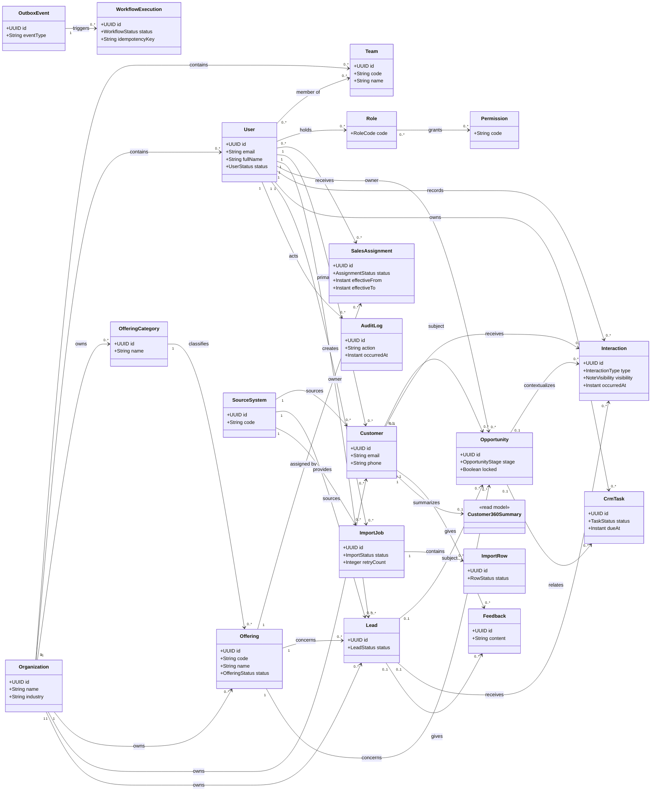

# Domain Class Diagram v1

## Mục tiêu

Domain Class Diagram v1 mô tả các class nghiệp vụ và quan hệ domain của POSE CRM theo Business Rules v1 và Roles and Authorization v1. Đây là đầu vào để Tài thiết kế Backend Spring Boot; không phải thiết kế bảng PostgreSQL.

**Owner:** Huỳnh Minh Tài. **Data Dictionary owner:** Vân Phạm Thảo Nhi. **Review sales flow:** Nguyễn Đức Thắng.

## 1. Ranh giới với Data Dictionary

- Class Diagram dùng tên class số ít, ví dụ `User`, `Opportunity`, `ImportJob`; thể hiện domain, quan hệ và trạng thái nghiệp vụ.
- Data Dictionary là nguồn duy nhất chốt tên bảng/cột, PostgreSQL type, primary key, foreign key, nullable, unique constraint, index và mapping class-bảng.
- Migration CRM chỉ được tạo sau khi Data Dictionary v1 được chốt. Class Diagram không tự thay thế quyết định database.

## 2. Nhóm domain class

| Nhóm | Class |
|---|---|
| Identity & organization | `Organization`, `Team`, `User`, `Role`, `Permission` |
| Offering & scope | `OfferingCategory`, `Offering`, `OfferingAttributeDefinition`, `OfferingAttributeValue`, `SalesAssignment` |
| CRM core | `Customer`, `Lead`, `Opportunity`, `Interaction`, `Feedback`, `CrmTask` |
| Data integration | `SourceSystem`, `ImportJob`, `ImportRow` |
| Cross-cutting | `AuditLog`, `OutboxEvent`, `WorkflowExecution` |
| Read model | `Customer360Summary`, dashboard projections |

`Customer360Summary` và dashboard projections là read model chỉ đọc, không phải aggregate nghiệp vụ được user sửa trực tiếp.

## 3. Quan hệ domain lõi

## 4. Domain rule cần thể hiện khi code

- Mọi aggregate nghiệp vụ thuộc đúng một `Organization`; Backend dùng organization scope trước khi kiểm tra role/team/record scope.
- `User` có thể giữ nhiều `Role`; permission hiệu lực là hợp permission của các role, nhưng không được vượt organization hoặc record scope.
- `SalesAssignment` liên kết một `Offering` với một Sales Staff và có thời gian hiệu lực. Sale không tự tạo hoặc tự gán assignment.
- `Opportunity` gắn với đúng một `Offering` và đúng một chủ thể là `Customer` hoặc `Lead`. `WON`/`LOST` là trạng thái locked; chỉ Manager có quyền mở lại.
- `Interaction.visibility` là `CARE_VISIBLE` hoặc `SALES_ONLY`; Customer Care không nhận note `SALES_ONLY`.
- `ImportJob` chỉ retry khi `FAILED`, dùng idempotency key và không tự merge dữ liệu rủi ro.
- `AuditLog`, `OutboxEvent` và `WorkflowExecution` là append-only. Dữ liệu CRM dùng archive/inactive thay vì hard delete trong MVP.

## 5. Đầu ra tiếp theo của Data Dictionary

Data Dictionary phải mapping từng class persistence sang bảng PostgreSQL, bao gồm quan hệ many-to-many `User-Role` và `User-Team`, field audit, unique identity theo organization, index scope và constraint cho Opportunity/Import. Sau khi Nhi chốt Data Dictionary, Tài mới tạo migration theo thứ tự Identity & Organization -> Offering & Assignment -> CRM Core -> Import/Audit/Workflow -> projection/seed data.
