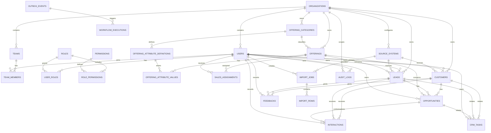

# ERD v1

## Mục tiêu

ERD v1 xác định dữ liệu lõi cho POSE CRM theo Business Rules v1 và Roles and Authorization v1. Đây là mô hình khái niệm để tạo Data Dictionary và migration CRM; chưa phải SQL migration.

**Owner Data Dictionary:** Vân Phạm Thảo Nhi. **Review kỹ thuật/RBAC:** Huỳnh Minh Tài. **Review sales flow:** Nguyễn Đức Thắng.

## 1. Nhóm entity

| Nhóm | Entity |
|---|---|
| Identity & organization | `organizations`, `teams`, `users`, `team_members`, `roles`, `permissions`, `user_roles`, `role_permissions` |
| Offering & scope | `offering_categories`, `offerings`, `offering_attribute_definitions`, `offering_attribute_values`, `sales_assignments` |
| CRM core | `customers`, `leads`, `opportunities`, `interactions`, `feedbacks`, `crm_tasks` |
| Data integration | `source_systems`, `import_jobs`, `import_rows` |
| Cross-cutting | `audit_logs`, `workflow_executions`, `outbox_events` |
| Read model | `customer_360_summary`, dashboard projections |

`customer_360_summary` và dashboard projections là view/projection chỉ đọc, không phải bảng nghiệp vụ cho user sửa trực tiếp.

## 2. Quan hệ lõi

## 3. Ràng buộc dữ liệu bắt buộc

- Mọi entity nghiệp vụ có `organization_id` trực tiếp hoặc được suy ra an toàn từ parent trong cùng transaction; migration CRM ưu tiên lưu trực tiếp để lọc scope rõ ràng.
- `users` thuộc đúng một organization; quan hệ với team dùng `team_members`.
- `sales_assignments` tham chiếu một Offering và một Sale user trong cùng organization, có `effective_from`, `effective_to` và status.
- Customer có một `primary_owner_user_id`; Lead và Opportunity có `owner_user_id`.
- Lead có một `offering_id`; Opportunity có đúng một `offering_id` và đúng một chủ thể: Customer hoặc Lead.
- Interaction, Feedback và CRM Task liên kết với Customer hoặc Lead; Task có thể liên kết thêm Opportunity.
- Email/phone đã chuẩn hóa được unique theo organization bằng partial unique index khi giá trị tồn tại.
- Customer 360/Dashboard không lưu metric có thể bị user cập nhật; metric tính từ bảng nghiệp vụ hoặc projection tái tạo được.
- Audit log và workflow execution là append-only; dữ liệu CRM nghiệp vụ dùng archive/inactive thay vì hard delete.

## 4. Entity chưa tạo bảng độc lập

- `Customer 360`: API read model tổng hợp Customer, owner, Offering, Lead, Opportunity, Interaction, Feedback và Task.
- `Dashboard`: query/projection từ dữ liệu nghiệp vụ có filter organization, team, owner, Offering, source và thời gian.
- `Notification`: workflow output ở giai đoạn đầu; chỉ tạo bảng riêng nếu cần trạng thái đọc/gửi trong API.

## 5. Thứ tự migration sau khi Data Dictionary hoàn thành

1. Identity & organization.
2. Offering, category, attribute và Sales Assignment.
3. Customer, Lead, Opportunity, Interaction, Feedback và CRM Task.
4. Source system, import, audit, outbox và workflow execution.
5. Customer 360/Dashboard projection, index và seed data.
